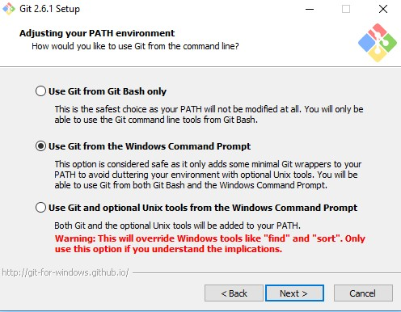

# tcclanjut
#Instalasi Git pada Windows

1.Setelah Git telah terdownload,instal git dengan double klik pada file yang didownload.lalu Akan muncul lisensi lalu pilih next untuk melakukan instal

2.Selanjutnya pilih penempatan instalasi,sebagai contoh untuk penempatan yaitu pada C:\Program Files\tcclanjut.

3.Sesuaikan komponen yang tidak perlu dilakukan rubah atau mengikuti secara default, lalu klik Next.

4.Melakukan pengisian shortcut untuk menu Start atau gunakan default dari notif git.

5.Memilih editor yang akan digunakan dengan Git sebagai contoh yang saya gunakan yaitu editor Notepad++.

6.Saat proses instalasi ini Git akan menyediakan akses git melalui Bash maupun command prompt lalu pilih kedua antarmuka tsb agar bisa digunakan. Bash atau shell di Linux yaitu pada windiws menggunakan bash di Windows. command line Windows bisa dilakukan menggunakan bash.

7.Lalu ilih OpenSSL untuk HTTPS. Untuk Git sendiri yaitu harus menggunakan https untuk akes ke repo GitHub.

8.Pilih dari pilihan pertama untuk konversi akhir baris (CR-LF).

9.Lalu untuk mengakses Git Bash pilih PuTTY untuk terminal yang digunakan.

10.Jika telah selesai akan muncul notifikasi pemberitahuan lalu klik Finish.

11.Tampilan padda Git Bash

12.Tampilan pada Git GUI

13.Lalu masuk ke command promp untuk melakukan eksekusi, "git --version" yaitu untuk melihat keterangan apakah sudah terinstall atau belum dan jika sudah terinstall makan akan muncul hasil seperti capture :

