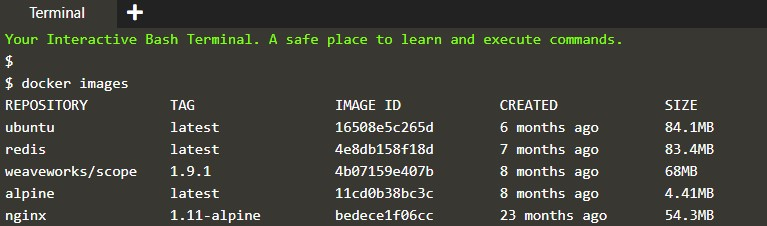
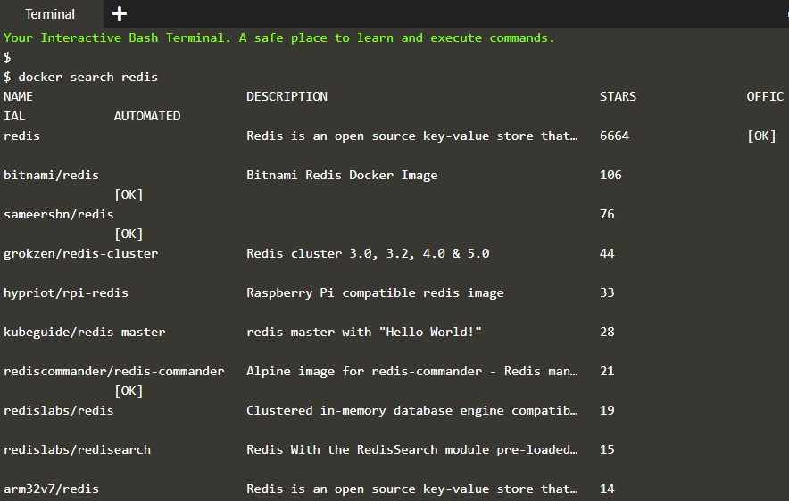
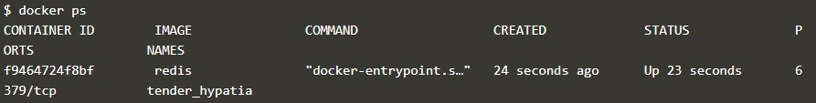
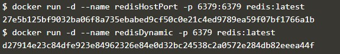
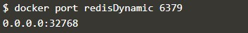
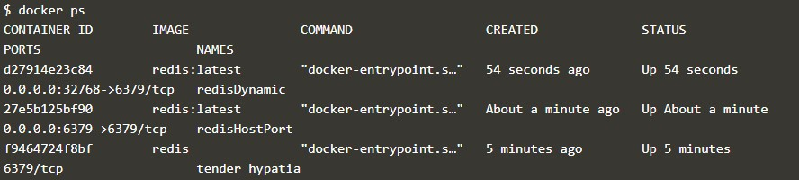
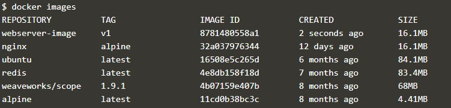
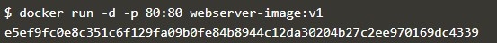

# tcclanjut minggu-03

enggunakan perintah build docker untuk membangun gambar. Anda bisa memberi gambar nama yang ramah dengan menggunakan opsi -t <name>.
Protip
Anda dapat menggunakan gambar buruh pelabuhan untuk melihat daftar gambar di mesin lokal Anda.

Luncurkan sebuah instance dari gambar Anda yang baru dibangun menggunakan hasil ID dari perintah build atau nama yang Anda berikan.

NGINX dirancang untuk dijalankan sebagai layanan latar belakang sehingga Anda harus menyertakan opsi -d. Untuk membuat server web dapat diakses, ikat ke port 80 menggunakan p 80:80

Sebagai contoh:
buruh pelabuhan menjalankan -d -p 80:80 <image-id | friendly-tag-name>

Anda dapat mengakses server web yang diluncurkan melalui buruh pelabuhan nama host. Setelah meluncurkan wadah, perintah curl -i http: // buruh pelabuhan akan mengembalikan file indeks kami melalui NGINX dan gambar yang kami buat.

Anda dapat memeriksa wadah berjalan menggunakan buruh pelabuhan ps

Tugas pertama adalah mengidentifikasi nama Gambar Docker yang dikonfigurasi untuk menjalankan Redis. Dengan Docker, semua wadah dimulai berdasarkan Gambar Docker. Gambar-gambar ini berisi semua yang diperlukan untuk memulai proses; host tidak memerlukan konfigurasi atau dependensi.

Jane dapat menemukan gambar yang ada di registry.hub.docker.com/ atau dengan menggunakan perintah docker search <name>. Misalnya, untuk menemukan gambar untuk Redis, Anda akan menggunakan redis pencarian buruh pelabuhan.

Menggunakan perintah pencarian, Jane telah mengidentifikasi bahwa Redis Docker Image disebut redis dan ingin menjalankan rilis terbaru. Karena Redis adalah basis data, Jane ingin menjalankannya sebagai layanan latar belakang sementara ia terus bekerja.
Untuk menyelesaikan langkah ini, luncurkan wadah di latar belakang menjalankan instance Redis berdasarkan gambar resmi.
CLI Docker memiliki perintah yang disebut run yang akan memulai wadah berdasarkan Gambar Docker. Strukturnya adalah buruh pelabuhan yang menjalankan <options> <image-name>.
Secara default, Docker akan menjalankan perintah di latar depan. Untuk berjalan di latar belakang, opsi -d harus ditentukan.

Kontainer yang diluncurkan berjalan di latar belakang, perintah docker ps mencantumkan semua kontainer yang berjalan, gambar yang digunakan untuk memulai wadah dan waktu aktif.

Perintah ini juga menampilkan nama dan ID ramah yang dapat digunakan untuk mencari tahu informasi tentang masing-masing wadah.
Perintah buruh pelabuhan memeriksa <friendly-name | container-id> memberikan rincian lebih lanjut tentang wadah berjalan, seperti alamat IP.
Log docker perintah <friendly-name | container-id> akan menampilkan pesan yang telah ditulis oleh kontainer ke kesalahan standar atau standar keluar.

Setelah membaca dokumentasi, Jane menemukan bahwa port terikat ketika kontainer mulai menggunakan opsi -p <host-port>: <container-port>. Jane juga menemukan bahwa berguna untuk mendefinisikan nama ketika memulai wadah, ini berarti dia tidak harus menggunakan Bash piping atau terus mencari nama ketika mencoba mengakses log.

Jane menemukan cara terbaik untuk menyelesaikan masalahnya menjalankan Redis di latar belakang, dengan nama redisHostPort di port 6379 menggunakan perintah berikut

Setelah bereksperimen, Jane menemukan bahwa hanya menggunakan opsi -p 6379 memungkinkannya untuk mengekspos Redis tetapi pada port yang tersedia secara acak. Dia memutuskan untuk menguji teorinya menggunakan docker run -d --name redisDynamic -p 6379 redis: terbaru

Sementara ini berhasil, dia sekarang tidak tahu port mana yang telah ditetapkan. Untungnya, ini ditemukan melalui port docker redisDynamic 6379

Jane juga menemukan bahwa daftar kontainer menampilkan informasi pemetaan pelabuhan, buruh pelabuhan ps

Menggunakan dokumentasi Docker Hub untuk Redis, Jane telah menyelidiki bahwa gambar resmi Redis menyimpan log dan data ke direktori / data.
Setiap data yang perlu disimpan di Host Docker, dan tidak di dalam kontainer, harus disimpan di / opt / docker / data / redis.
Perintah lengkap untuk menyelesaikan tugas adalah

Perintah buruh pelabuhan menjalankan ubuntu ps meluncurkan wadah Ubuntu dan mengeksekusi perintah ps untuk melihat semua proses yang berjalan dalam wadah.
Menggunakan docker run -it ubuntu bash memungkinkan Jane mendapatkan akses ke bash shell di dalam sebuah wadah.

Bangun gambar HTML statis kami menggunakan perintah build di bawah ini.
docker build -t webserver-image:v1

Anda dapat melihat daftar semua gambar di host menggunakan
docker image

Luncurkan gambar kami yang baru dibangun dengan memberikan nama dan tag yang ramah. Karena ini adalah server web, ikat port 80 ke host kami menggunakan parameter -p.

Setelah dimulai, Anda akan dapat mengakses hasil port 80 via

