Teknologi Cloud Computing minggu ke-04

Communicating Between Containers

Step 1 - Start Redis
Start Data Store
Run a redis server with a friendly name of redis-server which we'll connect to in the next step. This will be our source container.
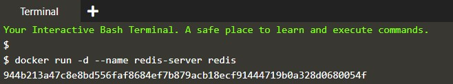

Step 2 - Create Link
First, Docker will set some environment variables based on the linked to the container. These environment variables give you a way to reference information such as Ports and IP addresses via known names.
You can output all the environment variables with the env command. For example:
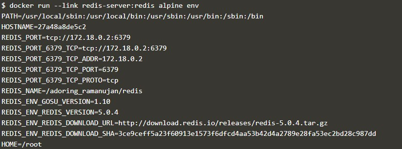

Secondly, Docker will update the HOSTS file of the container with an entry for our source container with three names, the original, the alias and the hash-id. You can output the containers host entry using 
cat /etc/hosts
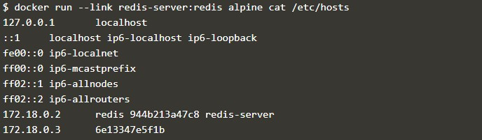

Example
With a link created you can ping the source container in the same way as if it were a server running in your network.
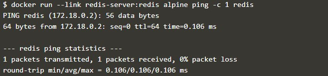

Step 3 - Connect To App
Example Application
Here is a simple node.js application which connects to redis using the hostname redis.
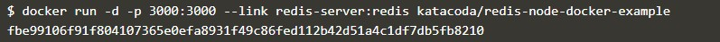

Test Connection
Sending an HTTP request to the application will store the request in Redis and return a count. If you issue multiple requests, you'll see the counter increment as items are persisted.
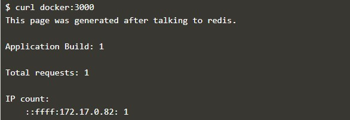

Step 4 - Connect to Redis CLI
Launching Redis CLI
The command below will launch an instance of the Redis-cli tool and connect to the redis server via its alias.
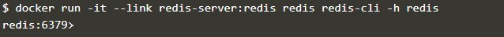

Issuing Commands
The command KEYS * will output the contents stored currently in the source redis container.

Type QUIT to exit the CLI.

Docker Networks

Step 1 - Create Network
Task: Create Network
To start with we create the network with our predefined name.
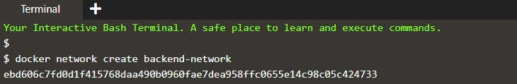

When we launch new containers, we can use the --net attribute to assign which network they should be connected to. 
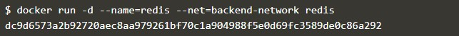

Step 2 - Network Communication
Task: Explore
The first thing you'll notice is that Docker no longer assigns environment variables or updates the hosts file of containers. Explore using the following two commands and you'll notice it no longer mentions other containers.
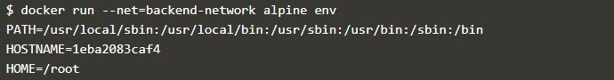
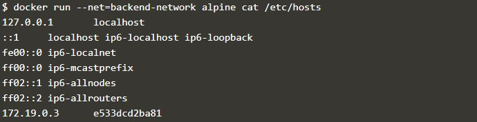

Instead, the way containers can communicate via an Embedded DNS Server in Docker. This DNS server is assigned to all containers via the IP 127.0.0.11 and set in the resolv.conf file.
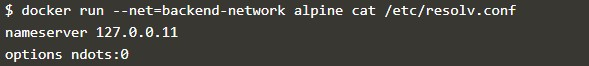

When containers attempt to access other containers via a well-known name, such as Redis, the DNS server will return the IP address of the correct Container. In this case, the fully qualified name of Redis will be redis.backend-network.
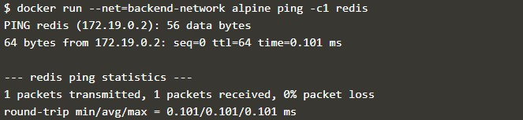

Step 3 - Connect Two Containers
Task
The first task is to create a new network in the same way.
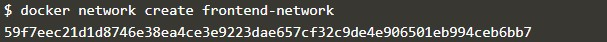

When using the connect command it is possible to attach existing containers to the network.

When we launch the web server, given it's attached to the same network it will be able to communicate with our Redis instance.
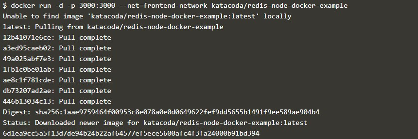

You can test it using curl docker:3000
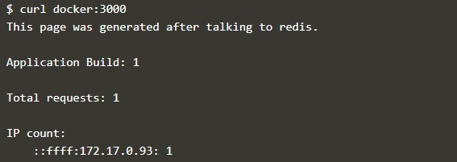

Step 4 - Create Aliases
Connect Container with Alias
The following command will connect our Redis instance to the frontend-network with the alias of db.
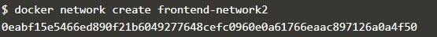

When containers attempt to access a service via the name db, they will be given the IP address of our Redis container.

Step 5 - Disconnect Containers
With our networks created, we can use the CLI to explore the details.

The following command will list all the networks on our host.
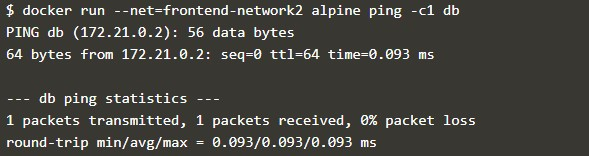

We can then explore the network to see which containers are attached and their IP addresses.
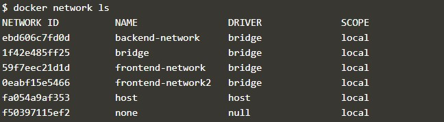

The following command disconnects the redis container from the frontend-network.
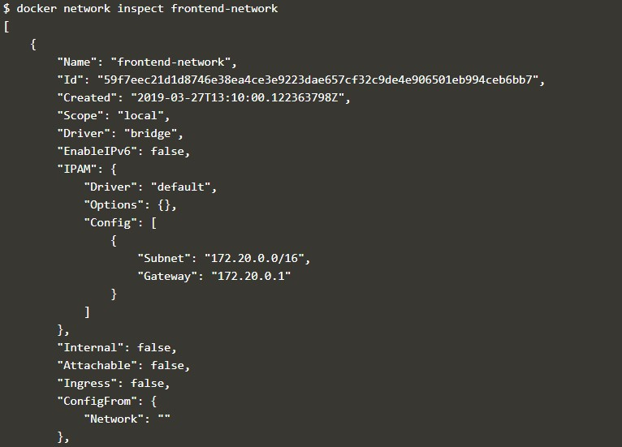

