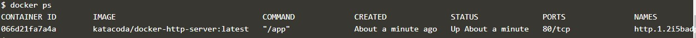
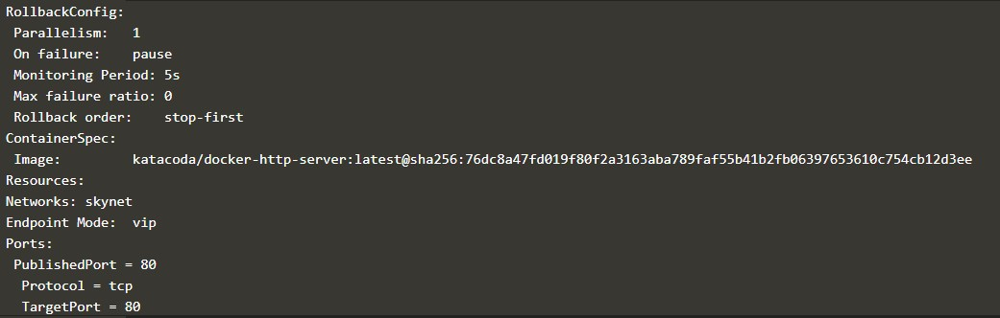

Docker Compose

Step 1 - Defining First Container
The format of the file is based on YAML (Yet Another Markup Language).

Step 2 - Defining Settings
To link two containers together to specify a links property and list required connections. For example, the following would link to the redis source container defined in the same file and assign the same name to the alias.

The same format is used for other properties such as ports

Define Second Container
Define the second container with the name redis which uses the image redis. Following the YAML format, the container details would be:

Step 4 - Docker Up

Launch your application using

Step 5 - Docker Management
Not only can Docker Compose manage starting containers but it also provides a way manage all the containers using a single command.

For example, to see the details of the launched containers you can use

To access all the logs via a single stream you use 

Other commands follow the same pattern. Discover them by typing 

Step 6 - Docker Scale
As Docker Compose understands how to launch your application containers, it can also be used to scale the number of containers running.
Scale the number of web containers you're running using the command

You can scale it back down using 

Step 7 - Docker Stop

As when we launched the application, to stop a set of containers you can use the command 

To remove all the containers use the command 

Docker Swarm

Step 1 - Initialise Swarm Mode
Terminal 1
Create Swarm Mode Cluster

Swarm Mode is built into the Docker CLI. You can find an overview the possibility commands via 

The most important one is how to initialise Swarm Mode. Initialisation is done via init.

Step 2 - Join Cluster
Ter 2
The first task is to obtain the token required to add a worker to the cluster. For demonstration purposes, we'll ask the manager what the token is via swarm join-token. In production, this token should be stored securely and only accessible by trusted individuals.

On the second host, join the cluster by requesting access via the manager. The token is provided as an additional parameter.

Ter 1
By default, the manager will automatically accept new nodes being added to the cluster. You can view all nodes in the cluster using 

Step 3 - Create Overlay Network
The following command will create a new overlay network called skynet. All containers registered to this network can communicate with each other, regardless of which node they are deployed onto.

Step 4 - Deploy Service
Instead, Docker load-balances requests across all available containers.

You can view the services running on the cluster using the CLI command 

As containers are started you will see them using the ps command. You should see one instance of the container on each host.
List containers on the first host - 

Terminal 2
List containers on the second host - 

Terminal 1
If we issue an HTTP request to the public port, it will be processed by the two containers

Step 5 - Inspect State
You can view the list of all the tasks associated with a service across the cluster. In this case, each task is a container 

You can view the details and configuration of a service via 

On each node, you can ask what tasks it is currently running. Self refers to the manager node Leader: 

Using the ID of a node you can query individual hosts 

Step 6 - Scale Service
At present, we have two load-balanced containers running, which are processing our requests 

The command below will scale our httpservice to be running across five containers.

On each host, you will see additional nodes being started

The load balancer will automatically be updated. Requests will now be processed across the new containers. Try issuing more commands via 

